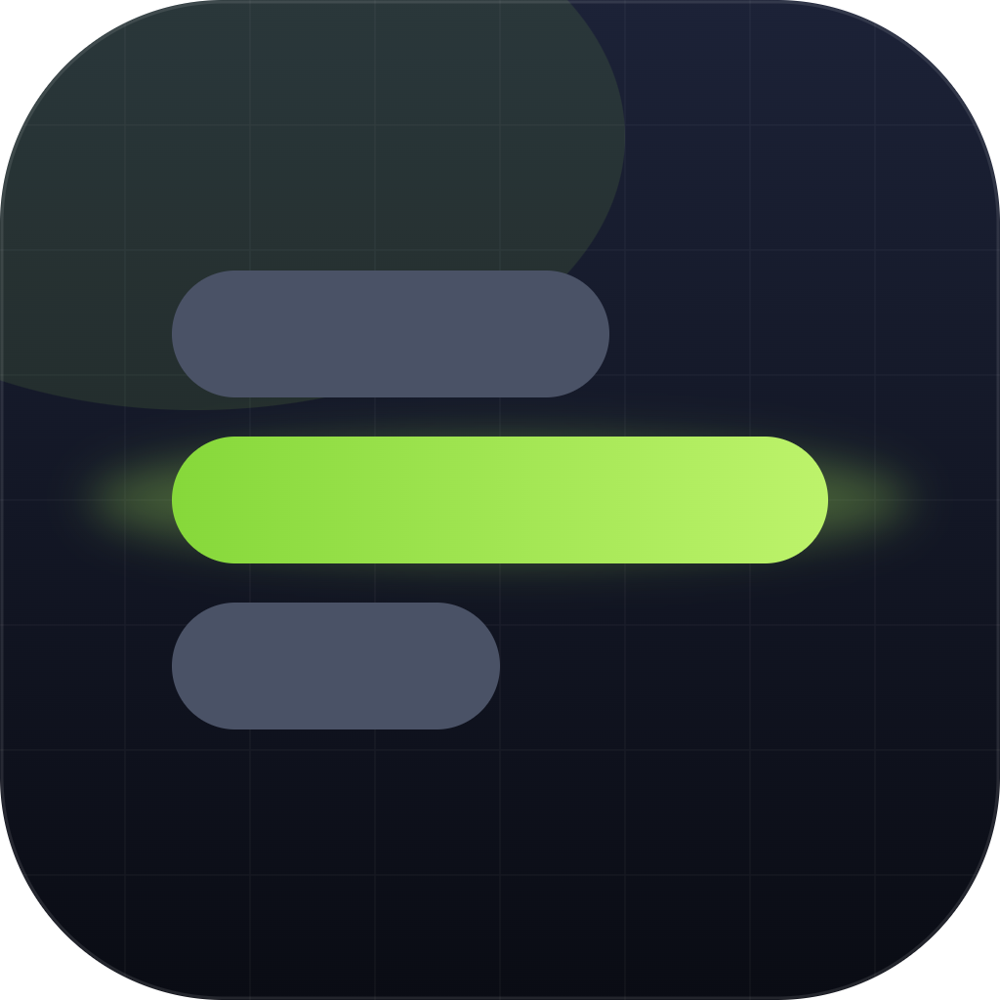

# zapret-ui

**Удобный графический интерфейс для обхода DPI-блокировок на Windows.**

Discord, YouTube и другие сервисы снова работают — без командной строки и возни с `.bat`-файлами.

 

 

[**⬇️ Скачать**](https://github.com/meldxkviel/zapret-ui/releases/latest) &nbsp;•&nbsp; [**📦 Возможности**](#-возможности) &nbsp;•&nbsp; [**🚀 Установка**](#-установка) &nbsp;•&nbsp; [**❓ FAQ**](#-частые-вопросы)

---

## 💡 Что это

Графическая оболочка на основе [`Flowseal/zapret-discord-youtube`](https://github.com/Flowseal/zapret-discord-youtube) — популярного инструмента обхода DPI. Приложение само скачивает zapret, разбирает его пресеты и запускает нужную стратегию одной кнопкой.

## 📦 Возможности

|  |  |
|---|---|
| ⬇️ **Авто-загрузка zapret** | Скачивает дистрибутив прямо из приложения, если его ещё нет на ПК. |
| 🎯 **Все стратегии из коробки** | Пресеты читаются из самого zapret (`general`, варианты `ALT`, `FAKE TLS`, `SIMPLE` и т.д.). |
| 🧪 **Автоподбор стратегии** | Встроенный тест прогоняет пресеты по заблокированным сайтам и сам выбирает лучший. |
| ▶️ **Процесс или служба** | Запуск кнопкой START или как служба Windows с автозапуском при загрузке. |
| 🔄 **Обновления в один клик** | Проверка и установка свежих версий zapret и самого приложения. |
| ⚙️ **Тонкая настройка** | Игровой фильтр, фильтр IP-списков, обновление IPSet и hosts. |
| 📋 **Живые логи** | Вывод `winws.exe` в реальном времени, тёмная/светлая тема, RU/EN, сворачивание в трей. |

## 🚀 Установка

1. Скачайте **`zapret-ui.exe`** из раздела [**Releases**](https://github.com/meldxkviel/zapret-ui/releases/latest).
2. Запустите. Установка не требуется — всё в одном файле.

> [!WARNING]
> При запуске Windows запросит права администратора (UAC) — это необходимо: обходу нужен драйвер WinDivert, а тесту стратегий и работе со службой нужны права.

## 🕹️ Как пользоваться

1. На вкладке **Home** нажмите **Install zapret** (если ещё не установлен).
2. Откройте **Strategies** и нажмите **Select** на нужном пресете — либо запустите **тест** и дайте приложению подобрать лучший автоматически.
3. Нажмите **START** (запуск как процесс) или **Run as service** (как служба, переживёт перезагрузку).
4. Не заработало у вашего провайдера? Попробуйте следующий вариант `ALT` — у разных операторов помогают разные стратегии.

## ❓ Частые вопросы

<b>Антивирус ругается на <code>winws.exe</code></b>

 

Ложное срабатывание: обход работает с сырыми сетевыми пакетами через WinDivert, и некоторые антивирусы считают это подозрительным. При необходимости добавьте папку установки в исключения. zapret-ui лишь оборачивает официальный дистрибутив.

<b>Почему приложение не использует GitHub API?</b>

 

У многих провайдеров `api.github.com` сам заблокирован DPI. Поэтому версия берётся с `raw.githubusercontent.com`, а архив — с `codeload.github.com`: они доступны там, где API уже недоступен.

<b>Где хранятся данные?</b>

 

Конфиг и установленный zapret лежат в `%APPDATA%\zapret-ui\`, логи — в `%APPDATA%\zapret-ui\logs\`.

## 🙌 Благодарности

zapret-ui — самостоятельная оболочка и **не входит в состав** перечисленных проектов; она лишь скачивает и запускает их на вашем компьютере. Все права на ядро обхода принадлежат их авторам:

- [**Flowseal/zapret-discord-youtube**](https://github.com/Flowseal/zapret-discord-youtube) — готовые стратегии и сборка, которые запускает это приложение.
- [**bol-van/zapret**](https://github.com/bol-van/zapret) — сам движок обхода DPI (`winws`).
- [**basil00/WinDivert**](https://github.com/basil00/WinDivert) — драйвер перехвата пакетов.

## 📄 Лицензия

Код zapret-ui распространяется под лицензией [MIT](LICENSE). Лицензии скачиваемых компонентов и их правообладатели описаны в [NOTICE.md](NOTICE.md).

 

Сделано с 💚 для свободного интернета

