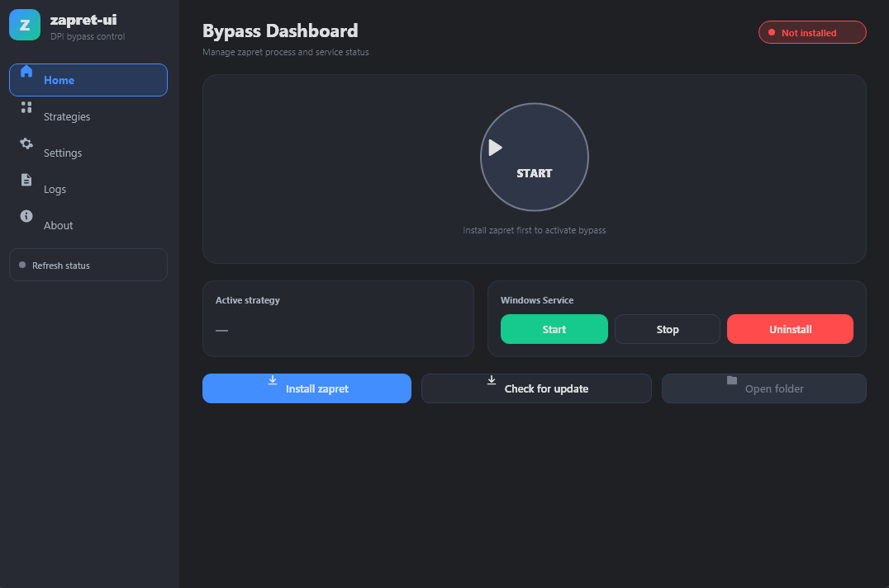

# zapret-ui

**Удобный графический интерфейс для обхода DPI-блокировок на Windows.**

Discord, YouTube и другие сервисы снова работают — без командной строки и возни с `.bat`-файлами.

---

## Что это

Графическая оболочка на основе [`Flowseal/zapret-discord-youtube`](https://github.com/Flowseal/zapret-discord-youtube) — популярного инструмента обхода DPI. Приложение само скачивает zapret, разбирает его пресеты и запускает нужную стратегию одной кнопкой. Один `.exe`, никаких дополнительных DLL.

## Возможности

- ⬇️ **Авто-загрузка zapret** прямо из приложения, если его ещё нет на ПК.
- 🎯 **Все стратегии из дистрибутива** — пресеты читаются из самого zapret (`general`, варианты `ALT`, `FAKE TLS`, `SIMPLE` и т.д.).
- 🧪 **Автоподбор стратегии** — встроенный тест прогоняет пресеты по заблокированным сайтам и сам выбирает лучший.
- ▶️ **Запуск как процесс** (кнопка START) или **как служба Windows** с автозапуском при загрузке.
- 🔄 **Проверка и установка обновлений** zapret в один клик.
- ⚙️ **Тонкая настройка**: игровой фильтр, фильтр IP-списков, обновление IPSet и hosts.
- 📋 Живые логи `winws.exe`, тёмная/светлая тема, русский и английский язык, сворачивание в трей.

## Установка

1. Скачайте **`zapret-ui.exe`** из раздела [**Releases**](https://github.com/meldxkviel/zapret-ui/releases/latest).
2. Запустите. Установка не требуется — всё в одном файле.

> 💡 Рекомендуется запускать **от имени администратора**: обходу нужен драйвер WinDivert. Без прав окно работает, но недоступен запуск обхода и тест стратегий (баннер вверху предложит перезапуск).

## Как пользоваться

1. На вкладке **Home** нажмите **Install zapret** (если ещё не установлен).
2. Откройте **Strategies** и нажмите **Select** на нужном пресете — либо запустите **тест** и дайте приложению подобрать лучший автоматически.
3. Нажмите **START** (запуск как процесс) или **Run as service** (как служба, переживёт перезагрузку).
4. Не заработало у вашего провайдера? Попробуйте следующий вариант `ALT` — у разных операторов помогают разные стратегии.

## Частые вопросы

**Антивирус ругается на `winws.exe`.**
Ложное срабатывание: обход работает с сырыми сетевыми пакетами через WinDivert, и некоторые антивирусы считают это подозрительным. При необходимости добавьте папку установки в исключения. zapret-ui лишь оборачивает официальный дистрибутив.

**Почему приложение не использует GitHub API?**
У многих провайдеров `api.github.com` сам заблокирован DPI. Поэтому версия берётся с `raw.githubusercontent.com`, а архив — с `codeload.github.com`: они доступны там, где API уже недоступен.

**Где хранятся данные?**
Конфиг и установленный zapret лежат в `%APPDATA%\zapret-ui\`, логи — в `%APPDATA%\zapret-ui\logs\`.

## Благодарности

zapret-ui — самостоятельная оболочка и **не входит в состав** перечисленных проектов; она лишь скачивает и запускает их на вашем компьютере. Все права на ядро обхода принадлежат их авторам:

- [**Flowseal/zapret-discord-youtube**](https://github.com/Flowseal/zapret-discord-youtube) — готовые стратегии и сборка, которые запускает это приложение.
- [**bol-van/zapret**](https://github.com/bol-van/zapret) — сам движок обхода DPI (`winws`).
- [**basil00/WinDivert**](https://github.com/basil00/WinDivert) — драйвер перехвата пакетов.

## Лицензия

Код zapret-ui распространяется под лицензией [MIT](LICENSE). Лицензии скачиваемых компонентов и их правообладатели описаны в [NOTICE.md](NOTICE.md).
