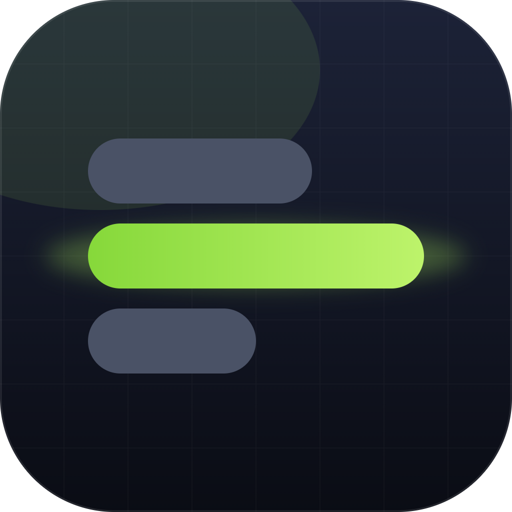

<div align="center">



# zapret-ui

**Удобный графический интерфейс для обхода DPI-блокировок на Windows и macOS Apple Silicon.**

Установка ядра, выбор стратегии и запуск обхода — в одном интерфейсе, без командной строки.

<br/>


[](https://github.com/meldxkviel/zapret-ui/actions/workflows/release.yml)
[](https://github.com/meldxkviel/zapret-ui/releases/latest)
[](LICENSE)

<br/>

[**⬇️ Скачать**](https://github.com/meldxkviel/zapret-ui/releases/latest) &nbsp;•&nbsp; [**📦 Возможности**](#-возможности) &nbsp;•&nbsp; [**🚀 Установка**](#-установка) &nbsp;•&nbsp; [**❓ FAQ**](#-частые-вопросы)

</div>

---

## 💡 Что это

Одно приложение на Rust + Slint для **Windows 10/11 x64** и **macOS 14+ Apple Silicon**. Интерфейс, простой режим, настройки, тест стратегий, логи и Telegram proxy развиваются вместе в одном репозитории. Приложение само загружает ядро для вашей системы и читает его актуальные стратегии.

| Платформа | Ядро обхода | Файлы одного релиза |
|---|---|---|
| Windows 10/11 x64 | [Flowseal/zapret-discord-youtube](https://github.com/Flowseal/zapret-discord-youtube) — `winws.exe`, пресеты `.bat` | `zapret-ui.exe` |
| macOS 14+ Apple Silicon | [Flowseal/zapret-mac-discord-youtube](https://github.com/Flowseal/zapret-mac-discord-youtube) — `utunws`, каталог TSV | `zapret-ui-macos-arm64.dmg` или `.zip` |

Новые релизы содержат обе сборки с одной версией и SHA-256 для каждого файла. Intel Mac и Linux пока не поддерживаются. Ядра скачиваются отдельно из приложения.

## 📦 Возможности

|  |  |
|---|---|
| ⬇️ **Авто-загрузка zapret** | Скачивает подходящее ядро прямо из приложения, если оно ещё не установлено. |
| 🎯 **Все стратегии из коробки** | Пресеты читаются из установленного ядра; их состав зависит от платформы и версии ядра. |
| 🪄 **Простой и расширенный режимы** | Одна кнопка для установки и подбора или ручной выбор стратегии и настроек. |
| 🧪 **Автоподбор стратегии** | Встроенный тест прогоняет пресеты по заблокированным сайтам и сам выбирает лучший. |
| ▶️ **Запуск одной кнопкой** | Windows: процесс или системная служба. macOS: системная служба launchd, которая продолжает работать после выхода из GUI. |
| 🔄 **Обновления** | Ядро обновляется из приложения на обеих платформах. Приложение: встроенное обновление на Windows, замена `.app` на macOS. |
| ⚙️ **Тонкая настройка** | IPSet и пользовательские списки; на Windows также игровой фильтр и hosts. |
| 📋 **Логи и интерфейс** | Тёмная/светлая тема, RU/EN, журнал событий, трей Windows и строка меню macOS. |
| ✈️ **Telegram proxy** | Встроенный локальный MTProto → WebSocket прокси, страница в приложении и подключение Telegram одной кнопкой. |

## 🚀 Установка

### Windows

1. Скачайте **`zapret-ui.exe`** из раздела [**Releases**](https://github.com/meldxkviel/zapret-ui/releases/latest).
2. Запустите. Установка не требуется — всё в одном файле.

> [!WARNING]
> При запуске Windows запросит права администратора (UAC) — это необходимо: обходу нужен драйвер WinDivert, а тесту стратегий и работе со службой нужны права.

### macOS 14+ (M1 или новее)

1. Скачайте **`zapret-ui-macos-arm64.dmg`** из [Releases](https://github.com/meldxkviel/zapret-ui/releases/latest).
2. Откройте образ, перетащите **Zapret UI** в **Applications** и запустите оттуда. Доступен также ZIP с тем же `.app`.
3. Установите ядро и запустите стратегию из интерфейса. Подтвердите системный запрос администратора.

GUI работает без повышения прав: не запускайте его через `sudo`. Администратор нужен только для системных операций ядра.

Сборка имеет локальную подпись, без нотарификации Apple. Если macOS блокирует первый запуск, разрешите его через **Системные настройки → Конфиденциальность и безопасность → Открыть всё равно**. [Подробная инструкция и сборка из исходников](docs/macos.md).

## 🕹️ Как пользоваться

В **простом режиме** нажмите центральную кнопку: приложение при необходимости скачает ядро, подберёт стратегию и включит обход. На Mac при проверке кандидатов могут повторяться системные запросы администратора.

В **расширенном режиме**:

1. На вкладке **Панель** установите ядро, если оно ещё не установлено.
2. В **Стратегиях** выберите пресет вручную или запустите **Тест стратегий**.
3. Нажмите **Запустить**. На Windows доступен запуск процессом или службой SCM; на macOS ядро всегда работает как системная служба launchd.
4. Если обход не помогает у вашего провайдера, попробуйте другой пресет и проверьте нужные сайты и приложения.

Служба ядра может работать после полного выхода из GUI. Telegram proxy работает только пока запущено приложение. Автозапуск GUI при входе в систему и автозапуск Telegram включаются отдельно в настройках.

### Telegram proxy

1. Откройте **Telegram proxy** синей кнопкой внизу бокового меню, над индикатором состояния → **Включить прокси**.
2. Нажмите **Подключить в Telegram** и подтвердите добавление прокси в клиенте.
   Если клиент не открылся, используйте **Скопировать ссылку**.
3. Оставьте zapret-ui открытым или свёрнутым в трей Windows / строку меню macOS. После остановки прокси
   отключите его в настройках Telegram, чтобы вернуться к обычному подключению.

Кнопка **Настройки прокси** внизу страницы открывает порт (по умолчанию 1443),
секрет MTProto, адреса WebSocket по DC, резервное TCP-подключение, тайм-аут и
лимит соединений. Настройки меняются при остановленном прокси. Пустой секрет
при сохранении заменяется случайным; после изменения порта/секрета добавьте
подключение в Telegram заново. Доступ только с текущего компьютера (`127.0.0.1`).

В настройках можно скрыть Telegram из бокового меню: это остановит прокси и
отключит его автозапуск. По умолчанию прокси выключен при открытии приложения;
при желании включите отдельную настройку автозапуска Telegram. Пока прокси
выключен, модуль не открывает порт, не создаёт фоновых задач и не обращается к
сети; TLS и буферы выделяются только после включения.
Прокси не требует установленного ядра zapret и работает независимо от его
стратегий. Встроенная реализация на Rust использует идею
[Flowseal/tg-ws-proxy](https://github.com/Flowseal/tg-ws-proxy), без Python,
отдельного процесса и скачивания движка. Код модуля входит в общий бинарник.

Поддерживаются abridged/intermediate/padded MTProto и прямые Telegram WSS
соединения с проверкой TLS-сертификатов; при разрешённом TCP fallback используется
обычный MTProto. Внешние CF-прокси, публичный доступ по LAN и Fake TLS не входят
в этот локальный модуль. Если медиа не загружаются, попробуйте оставить в DC
только `4:149.154.167.220` или очистить список.

## ❓ Частые вопросы

<details>
<summary><b>Антивирус ругается на <code>winws.exe</code></b></summary>

<br/>

Ложное срабатывание: обход работает с сырыми сетевыми пакетами через WinDivert, и некоторые антивирусы считают это подозрительным. При необходимости добавьте папку установки в исключения. zapret-ui лишь оборачивает официальный дистрибутив.

</details>

<details>
<summary><b>Почему приложение не использует GitHub API?</b></summary>

<br/>

У многих провайдеров `api.github.com` сам заблокирован DPI. Для Windows версия ядра берётся с `raw.githubusercontent.com`, архив — с `codeload.github.com`. На Mac используются Atom-лента релизов и готовый release-архив Flowseal; GitHub API также не нужен.

</details>

<details>
<summary><b>Где хранятся данные?</b></summary>

<br/>

На Windows конфиг и установленный zapret лежат в `%APPDATA%\zapret-ui\`, логи — в `%APPDATA%\zapret-ui\logs\`. На macOS настройки GUI — в `~/Library/Application Support/zapret-ui/`, пользовательские списки ядра — в `~/Library/Application Support/ZapretMac/`. [Все пути macOS](docs/macos.md#пути-и-диагностика).

</details>

## 🛠️ Разработка и сборка

Общие UI и логика находятся в `ui/`, `src/app/`, `src/config.rs`, `src/telegram/` и других общих модулях. Интерфейсы в `src/ports.rs` связывают их с адаптерами ядер и системными функциями. Новые функции и исправления по умолчанию добавляются для обеих платформ; различия ограничены возможностями ядра и API операционной системы.

Нужен Rust из [`rust-toolchain.toml`](rust-toolchain.toml). На Windows установите MSVC Build Tools, на Mac — Xcode Command Line Tools. Общие проверки на любой из поддерживаемых систем:

```sh
cargo fetch --locked
cargo fmt --all -- --check
cargo clippy --frozen --all-targets --all-features -- -D warnings
cargo test --frozen --all-targets --all-features
cargo run --locked --example ui_only
```

`ui_only` запускает общий интерфейс с моками, без установки ядра и изменения сети. Обычные тесты не требуют администратора и внешней сети; первый `cargo fetch` загружает зависимости.

- **Windows:** `cargo build --locked --release` → `target/release/zapret-ui.exe`.
- **Mac:** `sh scripts/build-macos.sh` → `.app`, DMG, ZIP и контрольные суммы в `dist/`. [Подробности сборки и диагностики Mac](docs/macos.md).

Один CI проверяет и собирает обе платформы. Публикация по тегу `v*` происходит только после успеха обеих сборок: полный набор файлов сначала проверяется в черновике релиза. [Участие в разработке](CONTRIBUTING.md) · [Правила для агентов](AGENTS.md) · [Выпуск релиза](docs/RELEASING.md).

## 🙌 Благодарности

zapret-ui — самостоятельная оболочка и **не входит в состав** перечисленных проектов; она лишь скачивает и запускает их на вашем компьютере. Все права на ядро обхода принадлежат их авторам:

- [**Flowseal/zapret-discord-youtube**](https://github.com/Flowseal/zapret-discord-youtube) — ядро и стратегии для Windows.
- [**Flowseal/zapret-mac-discord-youtube**](https://github.com/Flowseal/zapret-mac-discord-youtube) — ядро `utunws`, стратегии и системные скрипты для macOS.
- [**bol-van/zapret**](https://github.com/bol-van/zapret) — сам движок обхода DPI (`winws`).
- [**basil00/WinDivert**](https://github.com/basil00/WinDivert) — драйвер перехвата пакетов.
- [**Flowseal/tg-ws-proxy**](https://github.com/Flowseal/tg-ws-proxy) — идея локального MTProto → WebSocket моста для модуля Telegram.

## 📄 Лицензия

Код zapret-ui распространяется под лицензией [MIT](LICENSE). Лицензии скачиваемых компонентов и их правообладатели описаны в [NOTICE.md](NOTICE.md).

<div align="center">
<br/>

Сделано с 💚 для свободного интернета

</div>
